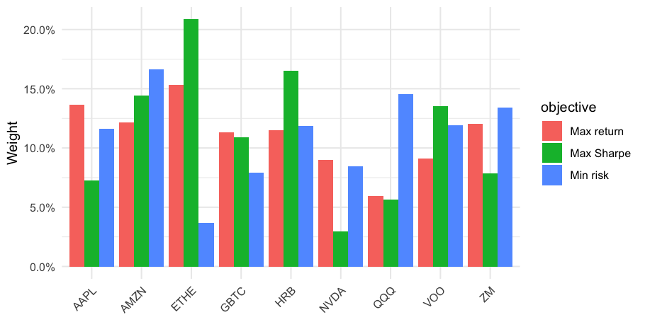
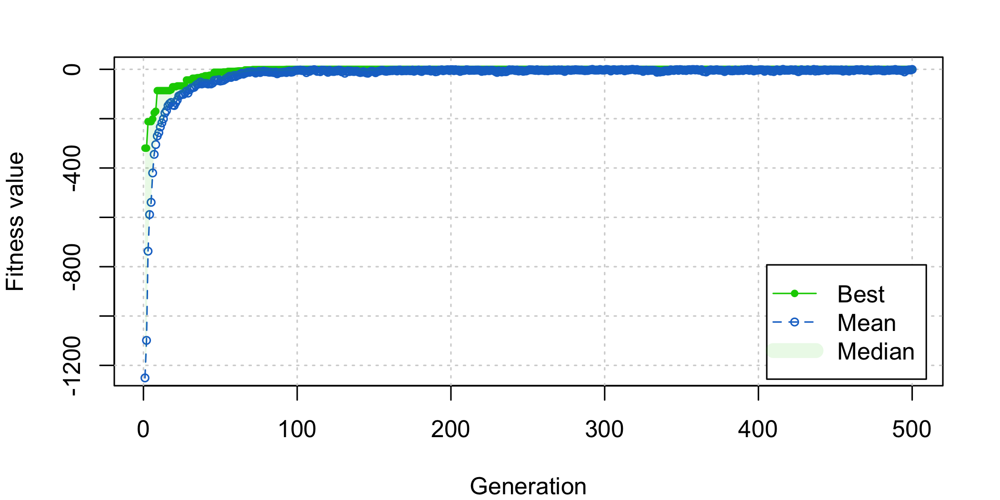

# Optimise stock portfolio with a genetic algorithm

A small R project that uses a genetic algorithm (GA) to choose portfolio
weights under several objectives — max Sharpe ratio, max return, min risk,
and two scaled Sharpe variants — and validates the resulting portfolios on a
held-out period. A second part uses a binary GA to *select* the top 10 stocks
out of a 50-stock universe before re-optimising their weights.

Originally a 2023 coursework project; refreshed in 2026 with a working data
pipeline (Yahoo's old `quantmod::getSymbols` path broke in 2024) and a clean
project layout.

## What's here

```
.
├── report/
│   └── portfolio-ga-analysis.Rmd   # main analysis (renders to PDF)
├── R/
│   └── exploration-draft.R         # earlier, messier version (kept for record)
├── data/
│   ├── fetch_data.R                # refresh the cached returns from Yahoo
│   ├── README.md                   # data source notes
│   └── cache/                      # committed snapshots (small .rds files)
└── output/
    └── portfolio-ga-analysis.pdf   # rendered report
```

## Methodology in one paragraph

Each stock's daily return is treated as a feature. Portfolio weights live in
$[0, 1]^n$ and are constrained to sum to 1 via a quadratic penalty. The GA
maximises a fitness that combines one of four objectives (mean return, negative
volatility, Sharpe, or a scaled Sharpe) with that penalty. Portfolios are fit
on 2020–2021 returns and re-evaluated on 2021–2022 returns as a simple
out-of-sample check. Part 2 adds a binary GA that selects exactly 10 stocks
from a 50-name universe by maximising summed Sharpe ratios.

### Headline figures





## Quick start

```bash
# R 4.x with: install.packages(c("GA", "quantmod", "tidyverse", "httr", "jsonlite", "xts"))
Rscript -e 'rmarkdown::render("report/portfolio-ga-analysis.Rmd")'
open output/portfolio-ga-analysis.pdf   # or wherever pandoc puts it
```

The cached snapshots in `data/cache/` are committed, so the report renders
without any network calls. To refresh them:

```bash
Rscript data/fetch_data.R
```

## Notes on data

As of 2024, `quantmod::getSymbols(src = "yahoo")` is broken: Yahoo removed the
`/v7/finance/download` endpoint. `data/fetch_data.R` uses the still-working
`v8/chart` API instead.

Some tickers from the original project are no longer available on the Yahoo
free API and are silently dropped:

| Ticker | Reason |
|--------|--------|
| `JWN`  | Returns HTTP 404 on the v8 free API (data gap, not delisted) |
| `DISCA`| Delisted after the Warner Bros. Discovery merger (Apr 2022) |
| `SQ`   | Renamed to BLOCK (now `XYZ`) |

The analysis handles missing tickers gracefully.

## Disclaimer

This is a learning exercise. Nothing here is investment advice.
